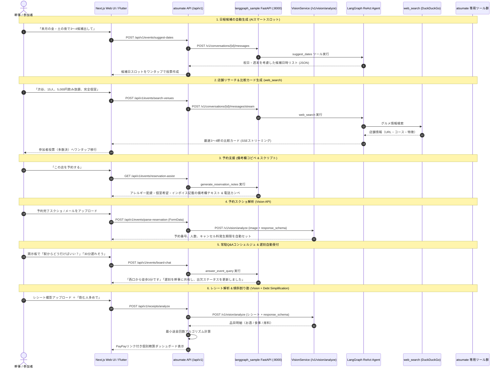

# AIエージェント詳細設計書 (AI Agent Design)
## 自前基盤「langgraph_sample」連携仕様

集まり企画・会計アプリ「atsumate」の目玉機能であるAI副幹事は、自前構築の **`langgraph_sample` (Python / FastAPI / LangGraph / Ollama / Vision API / Web Search)** をバックエンドとして利用します。

---

## 1. エージェント連携フロー全体図



---

## 2. `langgraph_sample` 側に追加する「atsumate 専用ツール」設計

`langgraph_sample/src/tools.py` または `src/services/` に追加定義するツール一覧です。

### ① `suggest_date_options` (候補日自動生成ツール)
- **説明**: 幹事の自然言語（「来月の金・土の夜」「再来週の平日」）とシステム日時から、祝日・連休を考慮した具体的な候補日時リストを生成する。
- **入力引数**:
  - `query`: 幹事の要望文
  - `duration_hours`: 想定イベント時間 (デフォルト: 2.5)
- **返却値**:
  - 候補日リスト (`[ { "start_at": "2026-10-09T19:00:00", "end_at": "2026-10-09T21:30:00", "reason": "金曜夜・翌日休日" } ]`)

### ② `search_venues` (店舗リサーチ比較ツール)
- **説明**: 人数、エリア、予算、席タイプ（個室等）、参加者アンケート（アレルギー・禁煙）を元に、`web_search` を自律実行して最適候補を比較抽出する。
- **入力引数**:
  - `location`: エリア (例: 渋谷駅周辺)
  - `headcount`: 人数 (例: 15)
  - `budget_per_person`: 1人あたり予算 (例: 5000)
  - `requirements`: 要望タグ (例: `["完全個室", "飲み放題", "甲殻類アレルギー配慮", "完全禁煙"]`)
- **返却値**:
  - 候補店舗比較カードリスト（店名、URL、コース名、価格、おすすめポイント、アレルギー対応可否）

### ③ `generate_reservation_notes` (予約要望テキスト & 電話カンペ生成ツール)
- **説明**: グルメ予約サイトの「備考欄」にコピペできる丁寧な要望文面、および電話予約時の通話スクリプトを生成する。
- **入力引数**:
  - `headcount`: 人数
  - `course_name`: コース名
  - `seating_pref`: 席の希望
  - `allergies`: アレルギー・NG食材リスト
  - `need_invoice`: インボイス制度対応領収書が必要か
- **返却値**:
  - `notes_text`: ネット予約の備考欄コピペ用テキスト
  - `phone_script`: 電話予約時の確認事項チェックリスト付き通話カンペ

### ④ `answer_event_query` (イベント常駐Q&Aコンシェルジュツール)
- **説明**: 掲示板に常駐し、参加者からの質問（集合場所、アクセス、服装、持ち物、遅刻時の連絡）にイベント概要・店舗情報を参照して即時自動回答する。
- **入力引数**:
  - `event_id`: 対象イベントID
  - `user_message`: 参加者の投稿テキスト
- **返却値**:
  - `reply_text`: 親しみやすく正確な返信テキスト
  - `action_type`: `"NONE"` | `"RECORD_DELAY"` | `"NOTIFY_ORGANIZER"`
  - `delay_minutes`: 遅刻連絡時の分数 (例: 30)

### ⑤ `calculate_custom_split` (自然言語 傾斜割り勘計算ツール)
- **説明**: レシート解析結果と参加者属性・幹事の指示（「飲む人多め、遅刻者半額」等）に基づき、各人の負担額を算出する。
- **入力引数**:
  - `total_amount`: 合計金額
  - `alcohol_amount`: お酒代合計
  - `food_amount`: 食事代合計
  - `participants`: 参加者リスト（飲む/飲まない、役職、遅刻フラグ等）
- **返却値**:
  - 各参加者の負担額一覧、端数調整額

---

## 3. Vision API (`/v1/vision/analyze`) のスキーマ定義

### 3.1 レシート画像解析スキーマ
```json
{
  "type": "object",
  "properties": {
    "merchant_name": { "type": "string", "description": "店舗名" },
    "date": { "type": "string", "description": "日付 YYYY-MM-DD" },
    "total_amount": { "type": "integer", "description": "支払総額（税込）" },
    "items": {
      "type": "array",
      "items": {
        "type": "object",
        "properties": {
          "name": { "type": "string", "description": "品目名" },
          "quantity": { "type": "integer", "description": "数量" },
          "unit_price": { "type": "integer", "description": "単価" },
          "category": { 
            "type": "string", 
            "enum": ["ALCOHOL", "FOOD", "SERVICE_OR_CHARGE", "OTHER"],
            "description": "品目カテゴリ"
          }
        },
        "required": ["name", "quantity", "unit_price", "category"]
      }
    }
  },
  "required": ["merchant_name", "total_amount", "items"]
}
```

### 3.2 予約完了画面・メールスクショ解析スキーマ
```json
{
  "type": "object",
  "properties": {
    "merchant_name": { "type": "string", "description": "予約先店舗名" },
    "reservation_number": { "type": "string", "description": "予約番号" },
    "reserved_date_time": { "type": "string", "description": "予約日時 (ISO8601 または YYYY-MM-DD HH:mm)" },
    "headcount": { "type": "integer", "description": "予約人数" },
    "course_title": { "type": "string", "description": "予約コース・プラン名" },
    "total_estimated_price": { "type": "integer", "description": "予定総額" },
    "cancellation_deadline": { "type": "string", "description": "人数変更・キャンセル無料期限 (例: 前日21:00)" }
  },
  "required": ["merchant_name", "headcount", "reserved_date_time"]
}
```
