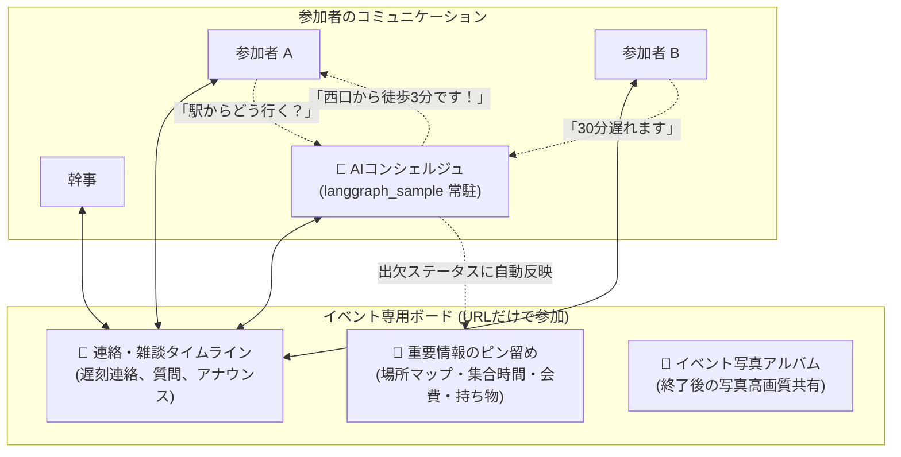

# AIエージェント駆動型 集まり企画・会計アプリ「atsumate」仕様書・企画設計書

---

## 1. サービスコンセプト & 企画背景

### 1.1 背景と課題：なぜ「幹事」はこんなに大変なのか？
飲み会、BBQ、サークル合宿、同窓会、旅行、会社の歓送迎会など、人が集まるイベントでは常に「幹事の負担」が問題になります。
- **日程調整の泥沼**: 候補日設定、集まらない回答、気まずい催促、主賓が来られない日の選択ミス。
- **お店選びのプレッシャー**: 条件（人数・予算・個室・料理・禁煙）検索の疲弊、アレルギー確認、幹事の独断で文句を言われる恐怖。
- **予約のトラブル**: 予約の失念、要望の伝え漏れ、直前キャンセル料の自腹リスク。
- **コミュニケーションの煩わしさ**: 一時的なLINEグループの作成（連絡先交換の抵抗感、抜けにくさ）、重要連絡が雑談で流れる、幹事への個別質問（駅の出口、服装、遅刻連絡）の殺到。
- **当日のバタバタ**: 役割分担があいまいで、結局幹事ひとりが受付・司会・タイムキープに追われる。
- **会計・割り勘の修羅場**: 複数人の立替混在、お酒を飲む/飲まない傾斜計算、端数処理、誰から誰への精算かわからない、未払いの催促。

### 1.2 コアバリュー：「AIが副幹事（Co-Organizer）として完全伴走する」
「**atsumate**」は、幹事の孤独な作業をなくし、**自前構築のLangGraphエージェント基盤（`langgraph_sample`）が専属の副幹事として、企画から日程調整・店選び・予約・連絡・当日の役割・会計完了までを一気通貫で自動化・先回りサポート**する次世代のイベント運営プラットフォームです。

```
【従来の幹事】
日程調整に苦労 → 店探しで疲弊 → 予約・キャンセル料リスク → 雑談で流れるLINE連絡 → 質問殺到でパンク → 複雑な割り勘 → 未払い集金
（すべて幹事の孤独な手作業 ＆ 精神的ストレス）

【atsumate + langgraph_sample エージェント】
幹事「渋谷で15人、予算5,000円で歓送迎会やりたい」と一言つぶやく
　↓
🤖 AI副幹事（LangGraph ReActエージェント）が即座に伴走：
  1. 【日程調整】カレンダー考慮で候補日を一括自動生成。主賓優先判定 & 遅刻者の開始時間シフトを提案
  2. 【お店選定】Web検索ツールで最適店を3〜4軒比較提示。参加者のワンタップ投票で納得決定
  3. 【予約アシスト】備考欄コピペ文 & 電話カンペ生成。Vision APIで予約スクショ読込 & キャンセル期限監視
  4. 【コミュニケーション】LINEグループ不要の専用ボード。重要事項ピン留め ＆ AIコンシェルジュが質問・遅刻を自動対応
  5. 【写真共有】イベント専用の高画質アルバムをワンタップ共有
  6. 【レシートOCR】写真を撮るだけでVision APIがお酒代・食事代を自動仕分け
  7. 【スマート割り勘】自然言語（飲む人多め等）から最小送金ルート（Debt Simplification）を瞬時に算出
```

---

## 2. 目玉機能：自前LangGraphエージェント（`langgraph_sample`）との連携仕様

本アプリのAI機能は、すでに構築済みの自前エージェント基盤 **`langgraph_sample` (Python / FastAPI / LangGraph / Ollama / Vision API / Web Search)** をコアエンジンとしてフル活用します。

```mermaid
graph TD
    User([幹事 / 参加者])

    subgraph "Web / Mobile Client"
        WebClient["Webフロント (Next.js 16)"]
        FlutterClient["モバイルアプリ (Flutter)"]
    end

    subgraph "atsumate Web Backend (Next.js / Vercel)"
        NextAPI["BFF / API Routes (/api/v1)"]
        Prisma["Prisma ORM"]
        AppDB[(PostgreSQL / atsumate DB)]
        EmailService["Resend / React Email"]
    end

    subgraph "AI Agent Server (langgraph_sample / FastAPI:8000)"
        AgentAPI["FastAPI (/v1/conversations, /v1/vision)"]
        ReActAgent["LangGraph ReAct Engine"]
        VisionService["VisionService (画像解析 + Structured Outputs)"]
        WebSearchTool["web_search (DuckDuckGo リアルタイム検索)"]
        AgentDB[(PostgreSQL / Checkpointer DB)]
        Ollama["Ollama / LLM (qwen3.5:9b / vision)"]
    end

    User <--> WebClient
    User <--> FlutterClient
    WebClient <--> NextAPI
    FlutterClient <-->|REST API (Bearer Token)| NextAPI
    NextAPI <--> Prisma
    Prisma <--> AppDB
    NextAPI --> EmailService

    %% Agent連携
    NextAPI <-->|HTTP / SSE / Bearer Auth| AgentAPI
    AgentAPI <--> ReActAgent
    AgentAPI <--> VisionService
    ReActAgent <--> WebSearchTool
    ReActAgent <--> AgentDB
    ReActAgent <--> Ollama
    VisionService <--> Ollama
```

---

## 3. システムアーキテクチャ & 技術スタック

### 3.1 技術選定一覧
| レイヤー | 技術選定 | 役割・選定理由 |
|:---|:---|:---|
| **Webフロントエンド** | Next.js 16 (App Router), TypeScript | 高速SSR、直感的なUI、Dockerによる自己ホスト |
| **モバイルアプリ (将来)** | Flutter (Dart) | iOS / Android の美麗なクロスプラットフォーム体験 |
| **AIエージェント基盤** | **`langgraph_sample`** (FastAPI + LangGraph) | **自前構築済みの自律ReActエージェント & Vision API & WebSearch** |
| **LLM / Vision** | Ollama (ローカルLLM / Vision) | プライバシー重視のローカル推論、高いコスト効率 |
| **Webバックエンド / DB** | Next.js Route Handlers + Prisma ORM + PostgreSQL | イベント出欠・タスク・会計トランザクション管理 |
| **メール送信基盤** | **Resend + React Email** | Vercel公式推奨。Reactコンポーネントで美しいHTMLメール配信 |
| **UIライブラリ** | Tailwind CSS, shadcn/ui, Lucide Icons | モダンでレスポンシブなスマホファーストUI |

### 3.2 Flutter（モバイル）連携に向けた REST API & 認証設計
- **Route Handlers による REST API 提供 (`/app/api/v1/...`)**:
  - Web画面だけでなく、Flutter（Dart の `http` / `dio`）から直接呼べる標準的な JSON REST API を提供。
- **Cookie と Bearer Token のハイブリッド認証**:
  - Webは Cookie セッション、Flutter モバイルは `Authorization: Bearer <token>` を自動判別して認証。
- **BFF（Backend For Frontend）アーキテクチャ**:
  - コアの割り勘計算やタスク管理のロジックを `services/` に集約し、Web（Server Actions）と Flutter（Route Handlers）で 100% 同一ロジックを共有。

---

## 4. 幹事の苦労をゼロにするコア機能設計

### 4.1 日程調整ソリューション (AIスマートスケジューリング)
1. **候補日の一括自動生成 (AIスマートスロット)**:
   - 「来月の金・土の夜で3〜4候補」の指示から、AIが祝日・連休を考慮した候補日を自動リスト化。
2. **★主賓・キーパーソン優先の重み付け判定**:
   - 歓迎会の主役や上司を「★キーパーソン」に設定。キーパーソンが「×」の日は自動除外し、出席率最大の日を第1推奨日としてリコメンド。
3. **「△」理由の構造化 & 開始時間シフト提案**:
   - 「遅刻」「早退」を構造化選択。AIが「19:30スタートにずらせば全員フル参加できます」と開始時間の最適化を提案。
4. **角の立たない自動締め切りリマインド**:
   - お店の予約枠キープを理由に、納得感のあるリマインド文を自動生成。

### 4.2 お店選定ソリューション (AI店舗リサーチ & 参加者投票)
1. **`web_search` による自動店舗リサーチ**:
   - 条件（人数・予算・個室・飲み放題・エリア）から、最新グルメ情報をもとに3〜4軒の比較カードを自動生成。
2. **参加者の好み・アレルギー自動集約**:
   - 出欠登録時に集めた「肉/魚」「禁煙」「アレルギー情報」をAIが自動考慮してフィルタリング。
3. **ワンタップ「参加者投票（多数決）機能」**:
   - 候補カードをそのままイベント画面内で投票に切り替え。幹事の独断プレッシャーを解消。
4. **決定店舗の自動同期**:
   - GoogleマップURL、住所、電話番号がイベント詳細、案内メール、カレンダーに自動反映。

### 4.3 予約フォローソリューション (予約アシスト & キャンセル料ガード)
1. **予約忘れ防止アラート**:
   - 人気日の即日予約を促す最重要バナーを固定表示。
2. **ネット予約の備考欄コピペ文生成**:
   - 人数、席の要望、アレルギー対応、インボイス領収書希望をまとめたテキストを一発生成。
3. **電話予約カンペ（通話スクリプト）**:
   - 電話予約時に確認すべき項目を画面表示しながらワンタップ発信。
4. **予約完了スクショの自動取り込み (`langgraph_sample` Vision API)**:
   - 完了画面やメールのスクショから予約番号・人数・コース・キャンセル規定を自動抽出。
5. **人数確定＆キャンセル料トラッキング**:
   - キャンセル料発生期限の24時間前にアラートを発行し、未定者へワンタップ最終確認。幹事の自腹リスクを完全防止。

---

### 4.4 参加者コミュニケーション設計 (専用ボード・AIコンシェルジュ・写真共有)



1. **LINEグループ不要のイベント専用ボード（プライベート保護）**:
   - 招待URLを開くだけで、参加者同士がニックネームで連絡可能。
   - 個人のLINEアカウントや電話番号を交換する必要がなく、サークルや社内イベントでもプライバシーが守られます。
2. **重要連絡の常時ピン留めヘッダー**:
   - 集合場所（Googleマップリンク）、集合時間、会費、持ち物、注意事項は、掲示板の最上部に常にカード形式でピン留め固定。雑談で情報が流れるトラブルを防止。
3. **AIコンシェルジュの常駐（幹事への問い合わせ集中を肩代わり）**:
   - 参加者からの「駅の何口？」「服装は？」「近くにコインパーキングある？」などの質問に、イベント概要・店舗情報を参照してAIが即時自動回答。
   - 「30分遅れます」という投稿を検知すると、AIが「承知しました！幹事に共有しました」と返答し、出欠ステータスに「30分遅刻」を自動反映。
4. **イベント写真アルバム機能**:
   - イベント中・終了後に撮った写真をワンタップでアップロード。
   - LINEのように保存期間切れで消えることなく、全員が高画質な集合写真や料理の写真をまとめてダウンロード可能。
5. **精算のオープン＆プライベート両立管理**:
   - 全体画面には「精算完了 12名 / 15名（80%）」のプログレスバーを表示（心理的な早期支払いを促進）。
   - 各自の送金先やPayPayリンクは本人専用カードにのみ表示し、プライバシーに配慮。

---

## 5. データベース設計 (Prisma スキーマ詳細)

```prisma
datasource db {
  provider = "postgresql"
  url      = env("DATABASE_URL")
}

generator client {
  provider = "prisma-client-js"
}

// 幹事ユーザー
model User {
  id            String    @id @default(cuid())
  name          String?
  email         String?   @unique
  events        Event[]
  createdAt     DateTime  @default(now())
  updatedAt     DateTime  @updatedAt
}

// イベント
model Event {
  id             String         @id @default(cuid())
  title          String
  slug           String         @unique // 招待URL用トークン
  description    String?        @db.Text
  
  // 日程調整
  hasDatePoll    Boolean        @default(false)
  eventDate      DateTime?      // 確定日時
  deadlineDate   DateTime?      // 出欠・日程投票締め切り
  dateOptions    EventDateOption[]

  // 会場・店舗情報
  locationName   String?
  locationAddress String?
  locationUrl    String?        // Googleマップリンク
  budgetEstimate Int?
  venueVoteStatus VenueVoteStatus @default(NOT_STARTED)
  venueOptions   VenueOption[]
  
  // 予約管理
  reservationStatus ReservationStatus @default(NOT_RESERVED)
  reservationNumber String?
  cancellationDeadline DateTime? // キャンセル料発生期限
  
  status         EventStatus    @default(PLANNING)
  aiConversationId String?      // langgraph_sample の conversation_id

  organizerId    String
  organizer      User           @relation(fields: [organizerId], references: [id])
  participants   Participant[]
  tasks          Task[]
  expenses       Expense[]
  settlements    Settlement[]
  boardPosts     BoardPost[]
  photos         EventPhoto[]

  createdAt      DateTime       @default(now())
  updatedAt      DateTime       @updatedAt
}

enum EventStatus {
  PLANNING    // 企画・日程調整中
  CONFIRMED   // 確定・準備中
  IN_PROGRESS // 当日進行中
  SETTLING    // 会計・精算中
  COMPLETED   // 精算完了
  CANCELLED
}

enum VenueVoteStatus {
  NOT_STARTED
  VOTING
  DECIDED
}

enum ReservationStatus {
  NOT_RESERVED
  RESERVED
  CONFIRMED
}

// 日程調整候補
model EventDateOption {
  id        String       @id @default(cuid())
  eventId   String
  event     Event        @relation(fields: [eventId], references: [id], onDelete: Cascade)
  startAt   DateTime
  endAt     DateTime?
  votes     DateVote[]
  isDecided Boolean      @default(false)
}

// 参加者の日程投票
model DateVote {
  id            String          @id @default(cuid())
  optionId      String
  option        EventDateOption @relation(fields: [optionId], references: [id], onDelete: Cascade)
  participantId String
  participant   Participant     @relation(fields: [participantId], references: [id], onDelete: Cascade)
  status        VoteStatus      // ATTENDING (○), CONDITIONAL (△), DECLINED (×)
  conditionNote String?         // "30分遅刻", "途中退出" 等

  @@unique([optionId, participantId])
}

enum VoteStatus {
  ATTENDING
  CONDITIONAL
  DECLINED
}

// 店舗候補 & 投票
model VenueOption {
  id          String      @id @default(cuid())
  eventId     String
  event       Event       @relation(fields: [eventId], references: [id], onDelete: Cascade)
  name        String
  url         String?     // 食べログ・ぐるなび等
  courseTitle String?
  pricePerPerson Int?
  features    String?     // 個室、禁煙、アレルギー対応可等
  isDecided   Boolean     @default(false)
  votes       VenueVote[]
}

model VenueVote {
  id            String      @id @default(cuid())
  venueId       String
  venue         VenueOption @relation(fields: [venueId], references: [id], onDelete: Cascade)
  participantId String
  participant   Participant @relation(fields: [participantId], references: [id], onDelete: Cascade)

  @@unique([venueId, participantId])
}

// 参加者（ゲスト対応）
model Participant {
  id             String             @id @default(cuid())
  eventId        String
  event          Event              @relation(fields: [eventId], references: [id], onDelete: Cascade)
  name           String
  email          String?            // リマインド受信用（任意）
  fcmToken       String?            // Flutter用Push通知トークン
  guestToken     String             @default(uuid())
  isKeyPerson    Boolean            @default(false) // ★主賓・キーパーソン
  attendance     AttendanceStatus   @default(UNDECIDED)
  delayMinutes   Int                @default(0)     // 遅刻分数 (0: 定刻)
  dietaryPref    String?            // アレルギー・好み
  splitTierName  String?            // "飲む", "飲まない", "学生"
  customRatio    Float              @default(1.0)

  dateVotes      DateVote[]
  venueVotes     VenueVote[]
  tasks          Task[]
  expensesPaid   Expense[]          @relation("Payer")
  expenseSplits  ExpenseSplit[]
  settlementsToPay   Settlement[]   @relation("FromParticipant")
  settlementsToReceive Settlement[] @relation("ToParticipant")
  boardPosts     BoardPost[]
  uploadedPhotos EventPhoto[]

  createdAt      DateTime           @default(now())
  updatedAt      DateTime           @updatedAt

  @@unique([eventId, guestToken])
}

enum AttendanceStatus {
  ATTENDING
  UNDECIDED
  DECLINED
}

// タスク・役割
model Task {
  id            String       @id @default(cuid())
  eventId       String
  event         Event        @relation(fields: [eventId], references: [id], onDelete: Cascade)
  title         String
  description   String?
  category      TaskCategory @default(PREPARATION)
  status        TaskStatus   @default(TODO)
  assignedToId  String?
  assignedTo    Participant? @relation(fields: [assignedToId], references: [id], onDelete: SetNull)
  isAIGenerated Boolean      @default(false)
  createdAt     DateTime     @default(now())
  updatedAt     DateTime     @updatedAt
}

enum TaskCategory {
  PREPARATION
  DAY_OF
}

enum TaskStatus {
  TODO
  IN_PROGRESS
  DONE
}

// 立替経費
model Expense {
  id            String         @id @default(cuid())
  eventId       String
  event         Event          @relation(fields: [eventId], references: [id], onDelete: Cascade)
  title         String
  amount        Int
  paidById      String
  paidBy        Participant    @relation("Payer", fields: [paidById], references: [id])
  receiptUrl    String?
  ocrRawData    Json?          // Vision API解析結果
  splits        ExpenseSplit[]
  createdAt     DateTime       @default(now())
  updatedAt     DateTime       @updatedAt
}

model ExpenseSplit {
  id            String      @id @default(cuid())
  expenseId     String
  expense       Expense     @relation(fields: [expenseId], references: [id], onDelete: Cascade)
  participantId String
  participant   Participant @relation(fields: [participantId], references: [id], onDelete: Cascade)
  allocatedAmount Int

  @@unique([expenseId, participantId])
}

// 最終精算（最小送金ルート）
model Settlement {
  id            String           @id @default(cuid())
  eventId       String
  event         Event            @relation(fields: [eventId], references: [id], onDelete: Cascade)
  fromId        String
  from          Participant      @relation("FromParticipant", fields: [fromId], references: [id])
  toId          String
  to            Participant      @relation("ToParticipant", fields: [toId], references: [id])
  amount        Int
  status        SettlementStatus @default(UNPAID)
  paidAt        DateTime?
  createdAt     DateTime         @default(now())
  updatedAt     DateTime         @updatedAt
}

enum SettlementStatus {
  UNPAID
  PAID
  CONFIRMED
}

// 共有掲示板 / タイムライン
model BoardPost {
  id            String       @id @default(cuid())
  eventId       String
  event         Event        @relation(fields: [eventId], references: [id], onDelete: Cascade)
  authorName    String
  content       String       @db.Text
  isPinned      Boolean      @default(false)
  isAIMessage   Boolean      @default(false)
  createdAt     DateTime     @default(now())
}

// イベント写真アルバム
model EventPhoto {
  id            String       @id @default(cuid())
  eventId       String
  event         Event        @relation(fields: [eventId], references: [id], onDelete: Cascade)
  photoUrl      String
  caption       String?
  uploadedById  String?
  uploadedBy    Participant? @relation(fields: [uploadedById], references: [id], onDelete: SetNull)
  createdAt     DateTime     @default(now())
}
```

---

## 6. 最小送金回数アルゴリズム (Debt Simplification)

複数人の立替払いを**ネット残高（Net Balance）**を用いてグリーディに集約し、送金回数を最大でも $N-1$ 回に抑えるアルゴリズムです。

```typescript
export function calculateMinimalSettlements(balances: { participantId: string; name: string; amount: number }[]) {
  const debtors = balances.filter(b => b.amount < -0.01).sort((a, b) => a.amount - b.amount);
  const creditors = balances.filter(b => b.amount > 0.01).sort((a, b) => b.amount - a.amount);
  const transfers = [];

  let i = 0, j = 0;
  while (i < debtors.length && j < creditors.length) {
    const debtor = debtors[i];
    const creditor = creditors[j];
    const settleAmount = Math.min(-debtor.amount, creditor.amount);

    transfers.push({
      fromId: debtor.participantId,
      fromName: debtor.name,
      toId: creditor.participantId,
      toName: creditor.name,
      amount: Math.round(settleAmount)
    });

    debtor.amount += settleAmount;
    creditor.amount -= settleAmount;

    if (Math.abs(debtor.amount) < 0.01) i++;
    if (Math.abs(creditor.amount) < 0.01) j++;
  }
  return transfers;
}
```

---

## 7. 通知・メール送信・リマインド設計 (Notification Architecture)

1. **LINE / SNS シェア (最優先)**:
   - 幹事がLINEグループに、AI生成テキスト + 招待URL / 個別PayPay送金リンクを1タップ送信。
2. **メール配信 (Resend + React Email)**:
   - アカウント不要。出欠登録時の任意アドレス宛に「回答控え」「前日案内」「精算明細」を自動配信。
3. **カレンダー連携 (端末標準アラート)**:
   - Googleカレンダー / Appleカレンダー（.ics）登録により、スマホ標準の「前日・1時間前アラーム」が確実に鳴る。
4. **アプリ Push 通知 (Flutter / FCM)**:
   - Flutter利用者のロック画面へ即時プッシュ通知。
5. **幹事へのリアルタイム検知**:
   - 参加回答時、締め切りアラート、送金完了報告を即座に通知。

---

## 8. 今後の開発ロードマップ

1. **Step 1: Next.js + Prisma 基盤 & REST API 構築** (PostgreSQL、Prisma スキーマ適用、`/api/v1` エンドポイント)
2. **Step 2: 日程調整 & 出欠・ゲスト参加モデル実装** (AI候補日生成、キーパーソン判定、投票UI)
3. **Step 3: 自前基盤 `langgraph_sample` 連携** (WebSearchによる店選び、Vision API レシート・予約スクショ解析、SSE対話)
4. **Step 4: コミュニケーションボード & 写真共有** (ピン留め、AIコンシェルジュ自動応答、アルバム機能)
5. **Step 5: 割り勘・最小送金エンジン & メール配信 (Resend)** (Debt Simplification、キャンセル料按分、個別精算メール)
6. **Step 6: Flutter モバイルアプリ開発** (Next.js REST API 接続、Push通知 FCM 実装)
